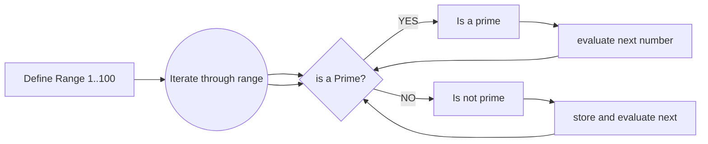

# CA-Workbook
# Q1
#### Describe at least five key events in the development of the internet:
- Throughout the 1980's the internet transformed into a worldwide network.  This was possible because of a computer scientist named Vinton Cerf, who's work developed a way for all computers on all of the worlds mini networks to communicate with each other.  This was called "Transmission Control Protocol".  Later an additional protocol was added, "internet protocol", known today as TCP/IP
- 1988: The Morris worm or Internet worm of November 2, 1988, was one of the first computer worms distributed via the Internet, and the first to gain significant mainstream media attention. It also resulted in the first felony conviction in the US under the 1986 Computer Fraud and Abuse Act. It was written by a graduate student at Cornell University, Robert Tappan Morris.
- 1990: Dial-up Internet access is a form of internet access that uses the facilities of the public switched telephone network (PSTN) to establish a connection to an Internet service provider (ISP) by dialing a telephone number on a conventional telephone line. Dial-up connections use modems to decode audio signals into data to send to a router or computer, and to encode signals from the latter two devices to send to another modem.
- 1998: Google, launched by Larry Page and Sergey Brin, went live in 1998.  Revolutionising the way in which people find information online. Larry Page and Sergey Brin, students at Stanford University in California, developed a search algorithm at first known as "BackRub" in 1996, with the help of Scott Hassan and Alan Steremberg.
- 2000: 2000 was the year of the dotcom collapse, resulting in huge losses for legions of investors. Hundreds of companies closed, some of which had never turned a profit for their investors. The NASDAQ, which listed a large number of tech companies affected by the bubble, peaked at over 5,000, then lost 10% of its value in a single day, and finally hit bottom in October of 2002.

### sources:
-  [https://www.history.com/topics/inventions/invention-of-the-internet](https://www.history.com/topics/inventions/invention-of-the-internet)
- [https://www.webfx.com/blog/web-design/the-history-of-the-internet-in-a-nutshell/](https://www.webfx.com/blog/web-design/the-history-of-the-internet-in-a-nutshell/)
- [https://en.wikipedia.org/wiki/Morris_worm](https://en.wikipedia.org/wiki/Morris_worm)
- [https://en.wikipedia.org/wiki/Dial-up_Internet_access](https://en.wikipedia.org/wiki/Dial-up_Internet_access)


# Q2
#### Define the features of the following technologies that are essential in terms of the development of the internet:
- **Packets**: A network packet is a formatted unit of data carried by a packet-switched network. A packet consists of control information and user data, which is also known as the payload. Control information provides data for delivering the payload. 
Packet switching is a rapid store and forward networking design that divides messages up into arbitrary packets, with routing decisions made per-packet. It provides better bandwidth utilization and response times than the traditional circuit-switching technology used for telephony, particularly on resource-limited interconnection links.
At a conference, Roger Scantlebury presented  Donald Davies work on packet switching for data communications and mentioned the work of  Paul Baran  at  RAND. Roberts incorporated the packet switching concepts into the ARPANET design and upgraded the proposed communications speed from 2.4 kbps to 50 kbps.
ARPA awarded the contract to build the network and the first ARPANET link was established between the  University of California, Los Angeles and the Stanford Research Institute on October 29, 1969
- **IP addresses (IPv4 and IPv6)**: An Internet Protocol address is also known as IP address. It is a numerical label which assigned to each device connected to a computer network which uses the IP for communication.
IPv4 was the first version of IP. It was deployed for production in the ARPANET in 1983. Today it is most widely used IP version. It is used to identify devices on a network using an addressing system.  It is considered the primary Internet Protocol and carries 94% of Internet traffic.
IPv6 is the most recent protocol.  This new IP address version is being deployed to fulfil the need for more Internet addresses. It was aimed to resolve issues which are associated with IPv4. 
- **Routers and Routing**  : A router is the traffic controller for data coming from and traveling via the internet. The router is generally connected to two or more points and distributes the packets of information from one source to the other (routing). The most common routing scenarios are experienced in the home and office by general commercial and consumer router products to allow for data exchange with the web and also internal networking.
Larry Roberts’ proposal that all host computers would connect to one another directly was not endorsed. Wesley Clark suggested to Roberts that the network be managed by identical small computers, each attached to a host computer. Accepting the idea, Roberts named the small computers dedicated to network administration, Interface Message Processors, which later evolved into today’s routers.
- **Domains and DNS** :  The Domain Name System (DNS) is the phonebook of the Internet. Humans access information online through domain names, like nytimes.com or espn.com. Web browsers interact through Internet Protocol (IP) addresses. DNS translates domain names to  IP addresses so browsers can load Internet resources.  Each device connected to the Internet has a unique IP address which other machines use to find the device.
Many of the milestones that led to the development of the modern Internet are already familiar to many of us, the invention of DNS the Domain Name System is a part of those milestones.  

### sources: 
- [https://en.wikipedia.org/wiki/Network_packet](https://en.wikipedia.org/wiki/Network_packet)
- [https://www.guru99.com/difference-ipv4-vs-ipv6.html](https://www.guru99.com/difference-ipv4-vs-ipv6.html)
- [https://en.wikipedia.org/wiki/Router_(computing)](https://en.wikipedia.org/wiki/Router_(computing))
- [https://www.cloudflare.com/learning/dns/what-is-dns/](https://www.cloudflare.com/learning/dns/what-is-dns/)
- [https://en.wikipedia.org/wiki/History_of_the_Internet#Development_of_packet_switching](https://en.wikipedia.org/wiki/History_of_the_Internet#Development_of_packet_switching)


# Q3
#### Define the features of the following technologies that are essential in terms of the development of the internet:
- **TCP**: TCP stands for Transmission Control Protocol.  TCP is a connection-oriented protocol. This means a connection is established and maintained until the application programs at each end have finished exchanging messages. It determines how to break application data into packets, which networks can deliver and send to.  It then accepts packets from the network layer and manages flow control. TCP works with the Internet Protocol, which defines how computers send packets of data to each other. Together, TCP and IP are the basic rules defining the Internet.
- **HTTP**:  HTTP (Hypertext Transfer Protocol) is the set of rules for transferring files, such as text, graphic images and sound.  It was developed by Tim Berners-Lee and his team between 1989-1991.  In 1989, while he was working at CERN, Tim Berners-Lee wrote a proposal to build a hypertext system over the Internet. Initially calling it the _Mesh_, it was later renamed to _World Wide Web_ during its implementation in 1990. Built over the existing TCP and IP protocols, it consisted of 4 building blocks (HTML, HTTP, a web browser and a server).  These four building blocks were completed by the end of 1990, and the first servers were already running outside of CERN by early 1991.
- **Web Browsers**: A web browser, or simply "browser," is an application used to access and view websites.  The primary function of a web browser is to render HTML, the code used to design or "mark up" webpages. Each time a browser loads a web page, it processes the HTML, which may include text, links, and references to images and other items, such as cascading style sheets and JavaScript functions. The browser processes these items, then renders them in the browser window.


#### sources: 
 - [https://developer.mozilla.org/en-US/docs/Web/HTTP/Basics_of_HTTP/Evolution_of_HTTP](https://developer.mozilla.org/en-US/docs/Web/HTTP/Basics_of_HTTP/Evolution_of_HTTP)
 - [https://techterms.com/definition/web_browser](https://techterms.com/definition/web_browser)
 -  [https://whatis.techtarget.com/definition/HTTP-Hypertext-Transfer-Protocol](https://whatis.techtarget.com/definition/HTTP-Hypertext-Transfer-Protocol)
 - [https://searchnetworking.techtarget.com/definition/TCP](https://searchnetworking.techtarget.com/definition/TCP)


 # Q4
#### Identify three data structures used in the Ruby programming language and explain the reasons for using each.

- **Arrays**:  An array is an ordered collection of any object. An array uses integers as its index. Uses for arrays include:
		- A base for more advanced data structures
		- Gathering results from a running loop
		- Accessing Elements
		- Searching through a collection of elements
- **Hash**: A Hash is a dictionary-like collection of unique keys and their values. Also called associative arrays, they are similar to Arrays, but where an Array uses integers as its index, a Hash allows you to use any object type. Hashes enumerate their values in the order that the corresponding keys were inserted.  Uses for Hashes include: 
		- As a way to have named parameters in functions
		- Easy way to represent data structures
		- Isolate data allowing for access to a key or the value
		- Mapping data, for ex. words to definitions or names to phone numbers
- **Stacks**: A stack is similar to an array.  It is a data structure which you can use as a collection of objects.  The difference is you keep taking elements from the stack & processing them until the stack is empty. There is no indexing with Stacks.  The data is structured by "Last-in First-out", meaning that when you remove and item from the stack, it will be the last item that was pushed into it.  Uses for Stacks include:
		- Convert a multi-dimensional array into a one-dimensional array
		- Managing instruction sequences
		- Parsing expressions

#### sources: 
- [https://www.rubyguides.com/2019/04/ruby-data-structures/](https://www.rubyguides.com/2019/04/ruby-data-structures/)
- [https://ruby-doc.org/core-2.7.0/Array.html](https://ruby-doc.org/core-2.7.0/Array.html)
- [https://ruby-doc.org/core-2.5.1/Hash.html](https://ruby-doc.org/core-2.5.1/Hash.html)
- [https://www.rubyguides.com/2017/03/computer-science-in-ruby-stacks/](https://www.rubyguides.com/2017/03/computer-science-in-ruby-stacks/)
- [https://medium.com/amiralles/stacks-are-a-special-kind-of-linked-lists-that-allow-us-to-efficiently-store-retrieve-data-in-last-9efab58fd100](https://medium.com/amiralles/stacks-are-a-special-kind-of-linked-lists-that-allow-us-to-efficiently-store-retrieve-data-in-last-9efab58fd100)

# Q5
#### Describe  the features of interpreters and compilers and how they are different.

  A compiler is a converter that translates high-level source code into low-level machine code for the computer to read.  A compiler can be divided into two parts.  The first part is called the front end, the front end scans the submitted source code for syntax errors, checks the type of each declared variable and ensures that each variable is declared before use.  If there are any errors it will provide an error message to the user.  If there is no error detected, another data structure, an an _intermediate representation_ of the code, is built from the source code and passed as input to the second part called the back end.  The back end uses the intermediate representation and a symbol table, containing the symbols found in the source code, to generate low level code. 
  Interpreters and compilers are very similar in structure. The main difference is that an interpreter directly executes the instructions in the source programming language while a compiler translates those instructions into efficient machine code.  An interpreter will typically generate an efficient intermediate representation and immediately evaluate it. Interpreted languages do show their value in development as they are much easier to pick errors from and make changes that can be checked over, piece by piece, as the program is in operation. This does make the interpreter slightly slower than the compiler, but the opportunity for error handling and active management of issues is enhanced.

#### sources: 
- [https://medium.com/hackernoon/compilers-and-interpreters-3e354a2e41cf](https://medium.com/hackernoon/compilers-and-interpreters-3e354a2e41cf)
- [https://techdifferences.com/difference-between-compiler-and-interpreter.html](https://techdifferences.com/difference-between-compiler-and-interpreter.html)

# Q6
####  Identify  two commonly used programming languages and  explain  the benefits and drawbacks of each.
- **JavaScript**: JavaScript is one of the more popular programming languages in the world.  Every time a website is not just static and contains movement such as - displaying timely content updates, interactive maps, animated 2D/3D graphics and scrolling video jukeboxes- JavaScript was more than likely involved.   JavaScript is used in conjunction with HTML and CSS to create an interactive and feature rich user experience.  
		**The Pros**: 
			- JavaScript tends to be very fast because it is often run immediately within the client's browser. So long as it doesn't require outside resources, JavaScript isn't slowed down by calls to a backend server. Also, major browsers all support JIT (just in time) compilation for JavaScript, meaning that there's no need to compile the code before running it.
			- JavaScript is everywhere on the web, and with the advent of Node.js, is increasingly used on the backend. There are countless resources to learn JavaScript. Both StackOverflow and GitHub show an increasing amount of projects that use JavaScript, and the traction it's gained in recent years is only expected to increase.
			- JavaScript is client-side, so it reduces the demand on servers overall, and simple applications may not need a server at all.
			- Developers can extend the functionality of web pages by writing snippets of JavaScript for third party add-ons like Greasemonkey.
			- Developers can extend the functionality of web pages by writing snippets of JavaScript for third party add-ons like Greasemonkey.
			**The Cons**:
			- Since JavaScript code is executed on the client-side, bugs and oversights can sometimes be exploited for malicious purposes. Because of this, some people choose to disable JavaScript entirely.
			- While server-side scripts always produce the same output, different browsers sometimes interpret JavaScript code differently. These days the differences are minimal, and you shouldn't have to worry about it as long as you test your script in all major browsers.

- **Ruby**:  A dynamic, open source programming language with a focus on simplicity and productivity. It has an elegant syntax that is natural to read and easy to write.  Ruby supports multiple programming paradigms including object-oriented and functional programming.
		**The Pros**:
				- Ruby offers "readable" code.  Meaning code similar to the language of the user. 
				- It provides higher abstraction, like object-oriented programming, functional programming, etc.
				- Ruby has a large and active user base.  This means many developers contribute to RubyGems packages.  
				- Ruby has many libraries and tools to help you along during your development.
				**The Cons**:
				- Ruby programming language is very strict in following some certain algorithms and standards while you are developing. There is not much room to go off script and wild with the features.
				- Ruby syntax can be very complex for developers to grasp all at once.
				- Ruby is also slower than statically compiled languages like Java.  This makes Ruby not the best choice for certain niche-types of of applications and certain types of internet scale.

#### sources:
- [https://www.infoworld.com/article/2870966/ruby-pioneers-come-clean-on-languages-shortcomings.html](https://www.infoworld.com/article/2870966/ruby-pioneers-come-clean-on-languages-shortcomings.html)
- [https://developer.mozilla.org/en-US/docs/Learn/JavaScript/First_steps/What_is_JavaScript](https://developer.mozilla.org/en-US/docs/Learn/JavaScript/First_steps/What_is_JavaScript)
- [https://www.freecodecamp.org/news/the-advantages-and-disadvantages-of-javascript/](https://www.freecodecamp.org/news/the-advantages-and-disadvantages-of-javascript/)
- [https://en.wikipedia.org/wiki/Ruby_(programming_language)](https://en.wikipedia.org/wiki/Ruby_(programming_language))
- [https://careerkarma.com/blog/what-is-ruby-used-for/](https://careerkarma.com/blog/what-is-ruby-used-for/)


# Q7
#### Identify two ethical issues from the areas below and discuss the extent to which an IT professional is ethically responsible in terms of the issue.

# Q8
#### Explain control flow, using an example from the Ruby programming language.
- In computer science control flow is the order in which individual statements , instructions or function calls of an imperative program are executed or evaluated.  The related statements are set out in a block of code and work forwards evaluating conditions to determine the next steps/outcomes. As an example, the following Ruby code aims to determine a person's favourite food and then returns a response:
```
   favourite_food = gets.chomp

    puts "What is your favourite food dish?"

    case favourite_food
    when "pizza"
        puts "Great choice, Pizza is the best!"
    when "chocolate"
        puts "Me too! Chocolate is my happy food."
    when "croissant"
        puts "Croissant and Cafe au lait please!"
    when "salmon"
        puts "Can never go wrong with Salmon."
    end 
```

In the above example, the case statement outlines the evaluation.  The user types their response into the console.  Then the ```when``` statements evaluates iterates through the outlined evaluation.  When the input matches the stated case the associated string is then returned to the console.

#### sources:
- [https://en.wikipedia.org/wiki/Control_flow](https://en.wikipedia.org/wiki/Control_flow)
- [https://www.rubyguides.com/2015/10/ruby-case/](https://www.rubyguides.com/2015/10/ruby-case/)


# Q9
#### Explain type coercion
- Type coercion is the process of changing a data type into another valid data type for use in programming. For example: in Ruby, if I was to receive a string input of `"9"` but I needed to use this input in a mathematical calculation in a later variable or operation, I could use a method like `.to_i` appended to the `gets` method that receives it to change it to the Integer `9`. Another example of type coercion in Ruby is using `.to_f` to convert the previously mentioned Integer into a Float (decimal number) for use in financial operations, for instance.

#### sources:
- [https://en.wikipedia.org/wiki/Type_conversion](https://en.wikipedia.org/wiki/Type_conversion)
- [https://www.freecodecamp.org/news/js-type-coercion-explained-27ba3d9a2839/](https://www.freecodecamp.org/news/js-type-coercion-explained-27ba3d9a2839/)

# Q10
#### Describe the data types recognised by the Ruby programming language.
**Ruby Data Types**:
-   _Strings_: A `String` object holds and manipulates an arbitrary sequence of bytes, typically representing characters.  A string of characters is stored in quotation marks.
   eg.
   ``` name = "Jessica"```
-   _Integers_: Holds Integer values.  These are whole numbers and can still be positive or negative.
   eg. 1, 100, -32.
-   _Floats_: these are decimal numbers. They are not contained in any symbols. They can also be positive or negative.
eg. 1.23, 102.4, -32.69
-   _Booleans_:  are  true or false values. They are not contained in any symbols.
  eg.
  ```is_a_human = true```   ```is_a_unicorn = false```

#### sources:
- [https://ruby-doc.org/core-2.6/String.html](https://ruby-doc.org/core-2.6/String.html)
- [https://ruby-doc.org/core-2.5.0/Integer.html](https://ruby-doc.org/core-2.5.0/Integer.html)
- [https://ruby-doc.org/core-2.5.0/Float.html](https://ruby-doc.org/core-2.5.0/Float.html)
- [https://www.rubyguides.com/2019/02/ruby-booleans/](https://www.rubyguides.com/2019/02/ruby-booleans/)


# Q11
#### “There is a restaurant serving a variety of food. The customers want to be able to buy food of their choice. All the staff just quit, how can you build an app to replace them?”
If I was building an app for the restaurant I would have classes such as a customer class, a menu class, payment class and a server class.
	- **Customer**: This class would take the information of the customer and utilise it in the app.
	- **Menu**: This class will provide a structure for the user to choose from and make sure the order is sent.
	- **Payment**:   This class will deal with the payment interaction between the user and the restaurant.
	- **Server**: The server class will take the place of the sever and handle the interaction between the user and their choices from the menu.

# Q12
#### Identify and explain the error in the following code that is preventing correct execution of the program.

```
celsius = gets
fahrenheit = (celsius * 9 / 5) + 32
print "The result is: "
print fahrenheit
puts "."
```

The code above does not convert the user input from a string to an integer.  The code as a result thinks celsius is a string and returns it 9 times.  To fix this you would convert the string to an integer when you get the user input with the ruby .to_i.

```celsius = gets.to_i```


# Q13
#### The following code looks for the first two elements that are out of order and swaps them; however, it is not producing the correct results. Rewrite the code so that it works correctly.

```
arr = [5, 22, 29, 39, 19, 51, 78, 96, 84]
i = 0
while (i < arr.size - 1 and arr[i] < arr[i + 1])
  i = i + 1 end
puts i
arr[i] = arr[i + 1]
arr[i + 1] = arr[i]
```
#### Solution:
```arr = [5, 22, 29, 39, 19, 51, 78, 96, 84]
i = 0
while (i < arr.size - 1 and arr[i] < arr[i + 1])
  i = i + 1 end
x = arr[i]
arr[i] = arr[i + 1]
arr[i + 1] = x
puts arr
```


# Q14
####   Demonstrate your algorithmic thinking through completing the following two tasks, in order:  
i. Create a flowchart to outline the steps for listing all prime numbers between 1 and 100 (inclusive). Your flowchart should make use of standard conventions for flowcharts to indicate processes, tasks, actions, or operations  
ii. Write pseudocode for the process outlined in your flowchart




```
range = [1..100]
prime = []
until range_value == 100 {
  check_prime{
    if range_value is prime ( value/1 or value/vlaue = 0 )
	   store in prime array
    else
       evaluate next range_value
    end
   }
}
```
# Q15
#### Write pseudocode OR Ruby code for the following problem:  
  
_You have access to two variables: raining (boolean) and temperature (integer). If it’s raining and the temperature is less than 15 degrees, print to the screen “It’s wet and cold”, if it is less than 15 but not raining print “It’s not raining but cold”. If it’s greater than or equal to 15 but not raining print “It’s warm but not raining”, and otherwise tell them “It’s warm and raining”._


# Q16
#### An allergy test produces a single numeric score which contains the information about all the allergies the person has (that they were tested for). The list of items (and their value) that were tested are:  
  
- eggs (1)  
- peanuts (2)  
- shellfish (4)  
- strawberries (8)  
- tomatoes (16)  
- chocolate (32)  
- pollen (64)  
- cats (128)  
So if Tom is allergic to peanuts and chocolate, he gets a score of 34.  
  
Write a program that, given a person’s score can tell them:  
a. whether or not they’re allergic to a given item  
b. the full list of allergies.

```
allergies = {
    "eggs" => "1",
    "peanuts" => "2",
    "shellfish" => "4",
    "strawberries" => "8",
    "tomatoes" => "16",
    "chocolate" => "32",
    "pollen" => "64",
    "cats" => "128"
}
//will them whether or not they are allergic//
def allergy_score(allergy)
allergy_score = []
  allergies.each do | item, score |
    if allergy == item
      allergy_score.push(score)
      end
  end
  allergy_score.each.sum
end

//prints list of allergies//
print allergies.keys